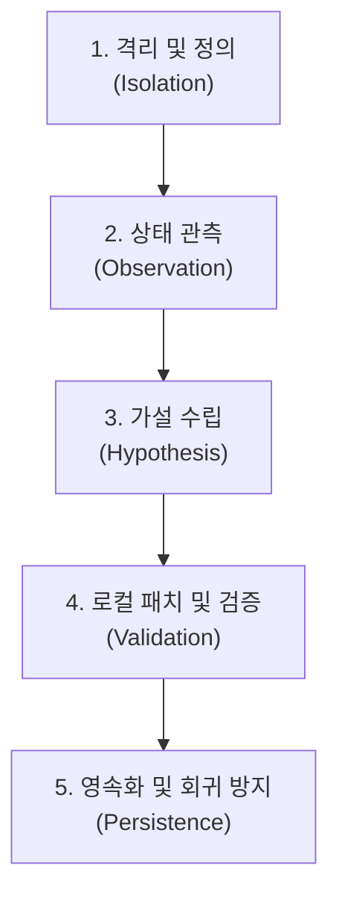

# Poorman's Gravity - Troubleshooting Guide & Debugging Methodology

이 문서는 웹뷰 터널링 및 파일 드래그앤드롭 자동화 시스템 개발 중 발생한 문제 해결 사례와 이를 바탕으로 수립한 체계적인 디버깅/트러블슈팅 방법론을 다룹니다.

---

## 1. 실전 문제 해결 사례 (Case Study: 2차 파일 요청 차단 문제)

### 1.1 증상 정의 (Symptom Definition)
* **현상**: 첫 번째 프로젝트 브리핑(규칙 파일 전송) 및 첫 Send는 정상 작동하나, 이후 AI가 파일 읽기(`[REQUEST: read-file "..."]`)를 연속 요구할 때 하단 드래그드롭 대기 큐 모달창이 나타나지 않고 무반응 상태가 됨.

### 1.2 가설 수립 및 원인 분석 (Hypothesis & Analysis)
* **가설 A (UI 제어 차단)**: 이전 수정 과정에서 도입한 업로드 완료 대기 함수(`waitForUploadComplete`)가 초기화되지 않은 웹뷰 요소 탐색으로 인해 메인 스레드를 Blocking하고 있음.
* **가설 B (비동기 병목)**: 후속 처리 함수(`activeDragDropContinue()`)가 실행을 마칠 때까지(AI 답변 수집 완료 시점까지) UI 클리어 및 모달 닫기 코드가 대기열에 묶여 UI가 프리징됨.
* **가설 C (AI 경로 인지 오류)**: 임시 규칙 파일이 `SendingMD/` 폴더 내에 생성되면서 AI가 프로젝트 컨텍스트의 모든 기준점을 `SendingMD/` 내부로 오인함. 그 결과 AI가 `SendingMD/package.json` 같은 비실존 경로를 요청하게 되어 드래그 큐가 가동 조건(`existingReadCount > 0`)을 만족하지 못하고 즉시 우회 전송됨.

### 1.3 디버깅 및 검증 과정 (Verification Process)
1. **환경 롤백**: 정상 기능이 훼손된 시점에서 기존 코드를 직전의 가장 안정적인 체크포인트(`f925c84`)로 즉시 **하드 롤백**하여 비교 대조군 확보.
2. **콘솔 로그 인젝션**: 분석기 진입점(`detectAndAskCommand`)에 실시간 경고 로그(`console.warn`)를 배치하여 수집된 원본 텍스트 관측.
   ```
   [detectAndAskCommand] Called. Text length: 130 
   Text preview: [REQUEST: read-file "SendingMD/package.json"] ...
   ```
3. **가설 C 검증 확인**: 콘솔 감시를 통해 AI가 실제로 파일 경로명 앞에 `SendingMD/`를 접두사로 붙여서 비실존 경로를 요구하고 있음을 최종 교차 검증함.

### 1.4 최종 해결 방안 (Resolution)
1. **경로 보정 필터(Path Sanitizer) 추가**:
   * AI가 `SendingMD/` 접두사를 붙여 잘못 요청하더라도 루트 경로에서 실제 존재 여부를 다시 확인해 접두사를 제거해주는 `resolvePathAndExists` 헬퍼 함수 도입.
2. **비동기 후속 처리 차단 해제**:
   * 드롭 완료 시 큐 초기화(`requestedFilesQueue = []`) 및 UI 숨김을 최우선적으로 **동기 실행**하고 후속 대기 루프(`continueFunc()`)는 비동기 백그라운드로 이관하여 UI 프리징 해소.

---

## 2. 체계적인 디버깅/트러블슈팅 방법론 (Methodology)

웹뷰 연동 및 오케스트레이션 애플리케이션 개발 시, 모호한 연쇄 오작동을 효과적으로 격리하고 해결하기 위해 아래의 **5단계 파이프라인**을 준수합니다.



### [Step 1] 문제 범위 격리 및 정의 (Isolation)
* **목표**: 오류가 발생하는 최소 조건과 영향 범위를 정량화합니다.
* **행동 지침**:
  * 최근 수정 사항 중 어떠한 요소가 개입했을 때 현상이 재현되는지 트리거를 파악합니다.
  * 기존 코드가 오작동할 경우, 무리한 수정 코드를 덮어쓰기 전에 **정상 동작하던 직전 Commit으로 즉시 Rollback**하여 비교 기준점을 명확히 합니다.

### [Step 2] 경계 상태 관측 및 텔레메트리 (Observation)
* **목표**: 블랙박스 영역(예: 게스트 웹뷰 DOM 내부 상태)의 데이터를 화이트박스 영역(호스트 콘솔)으로 강제 인출합니다.
* **행동 지침**:
  * 시스템 진입점 및 게스트-호스트 IPC 교차 지점에 일시적인 디버그 경고 로그(`console.warn` 또는 `console.error`)를 배치합니다.
  * AI 답변 텍스트, 원본 DOM Selector 매칭 여부, IPC 수신 데이터의 바이트 크기를 직접 콘솔에 찍어 실제 흐름과 가설 간의 불일치를 눈으로 직접 확인합니다.

### [Step 3] 가설 수립 및 차단 제거 (Hypothesis & Unblocking)
* **목표**: 수집된 관측값을 기반으로 병목 또는 오작동 유발 코드를 유추합니다.
* **행동 지침**:
  * **경로(Path) 문제**: 상대 경로 기준점 문제인지 검증합니다.
  * **블로킹(Blocking) 문제**: `await` 혹은 무한 루프(`while`, `setInterval`)가 메인 UI 스레드 및 다음 비동기 루틴을 블로킹하고 있지는 않은지 비동기 흐름도를 점검합니다.

### [Step 4] 정밀 수정 및 문맥 검증 (Local Validation)
* **목표**: 수정을 가한 후 변경된 결과가 다른 기존 기능에 영향을 미치는지 대조합니다.
* **행동 지침**:
  * 타깃 소스 수정을 진행한 직후에는 항상 **구문 검사 도구(예: `check_syntax.js`)**를 실행하여 괄호 미매칭 등 런타임 이전 단계의 신택스 오류를 예방합니다.
  * 수정 사항이 정상 가동되면 가장 먼저 '초기 브리핑(첫번째 Send)' 단계의 재현성 및 정상 가동 여부를 역순으로 다시 검사(Regression test)하여 기존 영역 침범 여부를 확인합니다.

### [Step 5] 버전 관리 및 이력 영속화 (Persistence)
* **목표**: 완벽히 검증된 성공적 수정 단계를 이력화하여 되돌릴 수 있는 안전장치를 만듭니다.
* **행동 지침**:
  * 작동 검증 즉시 타깃 파일별로 기능 수정 단위를 세분화하여 Git에 커밋합니다.
  * 커밋 메시지는 해결된 문제의 기능적 특성(예: `Add resolvePathAndExists sanitizer`)을 식별할 수 있도록 직관적으로 명명합니다.
